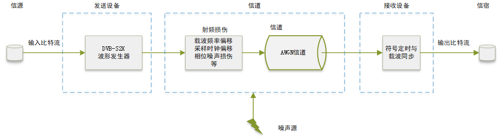
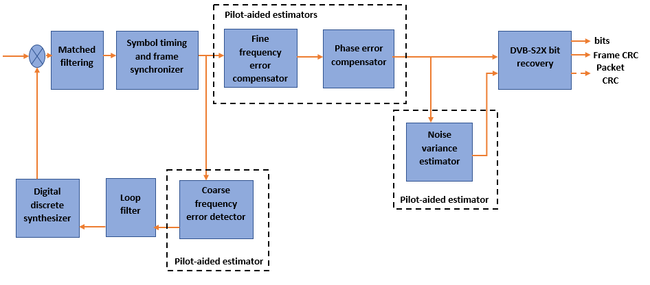
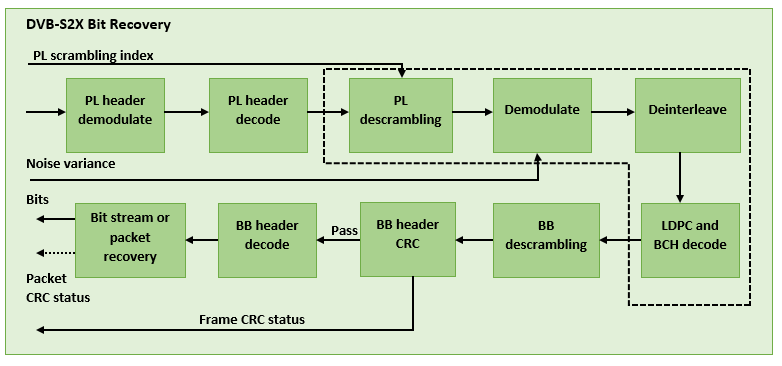

# DVB-S2

第一部分是DVB-S2/S2X系统实验。如DVB-S2X信号生成模块（发送端），端到端传输实验使用简单的AWGN数学模型仿真发射端与接收端之间的信道，也可以增加射频损失与校正。除了常规帧传输实验外，还给出了协议附录所列的宽带模式帧传输（基于时间分片的虚拟载波技术，获取特定TSN编号的数据帧），DVB-S2X协议新增加的超帧、VL-SNR帧等传输实验等。

## 一、DVB-S2X信号生成模块

`dvbs2xWaveformGenerator`模块可以生成单个或多个PL帧组成的DVB-S2X时域波形。

该模块能够根据用户设置的参数生成符合DVB-S2X标准的载波波形。用户可以通过设置载波频率、符号率、调制方式以及前向纠错编码等参数来定制所需的载波特征。

在生成载波波形时，该模块支持多种调制方式，包括QPSK、8PSK、16APSK、32APSK等，这些调制方式具有不同的传输效率和抗干扰性能，可以根据实际需求选择合适的调制方式。

此外，该模块还应用了LDPC（Low-Density Parity-Check）前向纠错编码技术，通过对生成的载波信号进行编码，提高了信号的可靠性和抗干扰性。编码后的信号还会经过滤波和修正处理，以进一步减小杂散，提升信号质量。

`dvbs2xWaveformGenerator`模块生成的载波波形符合DVB-S2X标准，并可以用于卫星通信系统中的发送端。它为卫星通信系统提供了高效、可靠的数据传输能力，满足了现代通信领域对高质量卫星通信的需求。

```matlab
% Syntax
s2xWaveGen = dvbs2xWaveformGenerator
s2xWaveGen = dvbs2xWaveformGenerator(Name,Value)
% Usage
txWaveform = s2xWaveGen(data)
```

更多请参考[1]。


## 二、常规帧传输

在发射端生成具有恒定编码调制的单流数字DVB-S2X常规帧。信道部分，调制信号需要增加射频损失，包括载波频率偏移、采样时钟偏移和相位噪声损伤，然后通过加性高斯白噪声`AWGN`信道。在接收端应用符号定时和载波同步策略，对接收到的信号进行同步和恢复。最后计算链路的分组错误率（PER，Packet Error Rate）和比特错误率（BER，Bit Error Rate）。



下面是接收端的同步和比特恢复工作流图。





更多请参考[2]。


> 下面是DVB-S协议附录内容（如基于时间分片的宽带卫星转发）或DVB-S2X一些新特性（如超帧结构、VL-SNR模式），不做过多展开，详细了解见协议原文及所列参考。

## 三、VL-SNR帧传输

`VL-SNR`，即Very Low Signal to Noise Ratio甚低信噪比，面向的是需要较低载波噪声和载波干扰的应用场景。VL-SNR格式下的调制方式选择较为低阶的调制，DVB-S2X标准在QPSK和BPSK范围内增加了九种额外的调制和编码方案（MODCOD）。这些MODCOD使卫星网络能够应对严重的大气衰落，并能够在运动场景（陆地、海洋和空中）中使用较小的天线尺寸。

更多请参考[3]。


## 四、宽带模式帧传输

卫星广播处理传统方式是把一个宽带转发器的带宽划分为多个更小的信道，并用相应数量的载波进行调制。但这种方式容易降低转发器的下行功率，不能获得最优的效率。

宽带模式是DVB-S2X标准中的一种可选传输格式，用于广播、专业和交互式服务的高符号率卫星载波。DVB-S2X采用WBT单载波技术（Wide Band Transponders，宽带转发器），该格式在单个频率上采用宽带卫星转发器（200­–500 MHz），并使用DVB-S2X标准中定义的时间切片概念。解调器接收整个转发器宽度内的信号并进行解调，优点是获得较高的数据率和频率效率。

在时间切片接收机中，采用虚拟载波技术将输入服务映射成流，每个物理帧对应一个时间切片号（TSN，Time Slice Number），基于报头中的TSN信息，用户选择并解码与所需服务有关的特定流，丢弃其他PL帧。FEC解码速度相当于100或200Mbps量级的常规DVB-S2应用的解码速度，但这种方法显著降低了接收设备的复杂性。

更多请参考[4]。


## 五、超帧生成

超帧框架是可选的，因为不同超帧格式的结构差异较大，所有的超帧格式也都是独立可选的。超帧框架设计目标体现在：（1）由于超帧加扰，提高了对DTH和宽带应用的其他波束引起的同信道干扰的抵抗力；（2）由于定期插入参考数据字段而支持同步算法，从而在诸如 VL-SNR 或链路中断等严重信道条件下增强接收器性能；（3）具有内容格式信令的面向未来的帧设计，能够适应或支持：干扰缓解技术，波束跳跃操作，多格式传输。

在运行代码时，matlab版本需在2022a及以上。

更多请参考[5]。


### 参考资料

[1] [Generate DVB-S2X waveform - MATLAB - MathWorks 中国](https://ww2.mathworks.cn/help/satcom/ref/dvbs2xwaveformgenerator-system-object.html)

[2] [End-to-End DVB-S2X Simulation with RF Impairments and Corrections for Regular Frames - MATLAB & Simulink - MathWorks 中国](https://ww2.mathworks.cn/help/satcom/ug/end-to-end-dvbs2x-simulation-with-rf-impairments-and-corrections-for-regular-frames.html)

[3] [End-to-End DVB-S2X Simulation with RF Impairments and Corrections for VL-SNR Frames - MATLAB & Simulink - MathWorks 中国](https://ww2.mathworks.cn/help/satcom/ug/end-to-end-dvbs2x-simulation-with-rf-impairments-and-corrections-for-vlsnr-frames.html?searchHighlight=vl-snr&s_tid=srchtitle_vl-snr_1)

[4] [End­­-to­­-End DVB-S2X Simulation with RF Impairments and Corrections in Wideband Mode - MATLAB & Simulink (mathworks.com)](https://www.mathworks.com/help/satcom/ug/end-to-end-dvbs2x-simulation-with-rf-impairments-and-corrections-in-wideband-mode.html)

[5] [DVB-S2X Super-Frame Generation for Formats 0 and 1 - MATLAB & Simulink (mathworks.com)](https://www.mathworks.com/help/satcom/ug/dvbs2x-superframe-generation-for-formats-0-and-1.html)