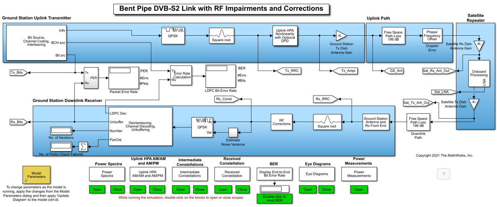

# DVB-S2 Bent Pipe Simulation with RF Impairments and Corrections

## 一、简介

上一部分的仿真实验主要是使用简单的`AWGN`数学模型来仿真发射器和接接收器间的信道。本部分将基于`Simulink`平台搭建贴近真实场景的弯管式链路系统，在此基础上，可观测分析地面站发射和接收信号的功率谱、卫星星上信号以及星座图，探究不同调制编码方式、带宽、滚降系数、卫星轨道高度对链路传输性能的影响，也可设置相关参数验证DVB-S2/S2X窄带通信性能。

> 有关弯管式链路了解参考[第四部分](#四、相关背景)。

该链路将DVB-S2信号从第一地面站传输到卫星。卫星接收模拟信号，在没有解调的情况下对其进行放大和滤波，然后将其转发给第二个地面站。该地面站对信号进行解调和解码，最后计算端到端的分组错误率PER和比特错误率BER。

## 二、模型

下图所示为`MATLAB`提供的弯管式卫星链路模型。

有关项目工程，如已安装MATLAB，可见**\examples\satcom文件夹下的DVBS2BentPipeSimulationWithRFImpairmentsAndCorrectionsExample.m。或见参考[3]。

## 三、实践

基于Simulink平台搭建贴近真实场景的弯管式链路系统，验证DVB-S2/S2X通信性能。如先以一组QPSK 1/4码率常规帧长传输实验为例，观测分析地面站发射和接收信号的功率谱、卫星星上信号以及星座图。然后探讨不同调制编码方式、带宽、滚降系数、卫星轨道高度等对链路传输性能的影响。

下面给出部分参考：

1. 针对弯管式卫星链路以及窄带通信，主要参考AYECKA的IoT First服务[4] 的参数设置，在Simulink上搭建弯管式卫星链路进行端到端仿真测试。IoT First服务的传输频率为Ku波段: 13.75–14.5 GHz，接收频率为Ku波段: 10.7–12.75 GHz (dual band)，调制方式为QPSK, 8PSK,16APSK, 32APSK，入站信道带宽提供有2.5, 5, 10 MHz。
2. 首先，以常用卫星带宽36MHz，滚降因子0.25，调制编码方式为QPSK 1/4为例，常规帧长进行链路仿真。
3. 然后探讨不同调制编码方式，不同滚降系数以及IoTFIRST提供的若干窄带宽下的情形。如8PSK 3/5调制编码方式下的性能。设置的仿真时间为0.025s，关闭了射频校正模块。
4. 卫星轨道高度同样可调。探究地球静止轨道、中高地球轨道卫星和低地球轨道卫星三种轨道高度的场景。以QPSK 1/4码率，滚降系数0.25为例进行实验。
5. 上述设置的接收器噪声系数为3dB，接收器天线尺寸为8m。进一步，探究在不同的轨道高度上如何减小天线尺寸，或者增加接收机噪声系数，对实验的BER/PER有何影响。

更多可结合所列参考资料[1-3]进行学习。

## 四、相关背景

卫星网络主要包括**星上处理**（OBP，On-Board Processing）和**弯管式**(BP, Bent Pipe) 这两种体系结构。OBP主要依托搭载的CPU内核进行调度控制，FPGA提供信号调制解调功能，性能较高，关注度较高，但受限于芯片处理能力、载荷功率以及星上物理可用空间，成本也较高。BP的成本低，没有星间链路(ISL, Inter-Satellite Link)。早期的卫星通信系统多采用BP技术。相应的，卫星转发器通常分为处理转发器或透明转发器，透明转发器又称为弯管式转发器。卫星透明转发器中“透明”的含义是指星上对上行信号只进行变频放大，不进行调制解调等处理。

**工作过程**为：星上接收天线接收上行信号，由接收机低噪声放大后将频率变为下行频率，再经限幅放大单元放大和电平调节后通过末级放大器放大，由发射天线发给地面用户设备[5]。其缺点是必须时刻依赖地面网关站，否则无法接入地面网络。优点在于卫星简单可靠，而且信号格式、通信标准完全取决于地面终端和网关站，卫星成本高昂，通信技术更新迭代也很快，卫星不会限制系统的升级换代。

### 参考资料

[[1] RF Satellite Link - MATLAB & Simulink - MathWorks 中国.](https://ww2.mathworks.cn/help/comm/ug/rf-satellite-link.html)

[[2] DVB-S.2 Link, Including LDPC Coding in Simulink - MATLAB & Simulink - MathWorks 中国.](https://ww2.mathworks.cn/help/comm/ug/dvb-s-2-link-including-ldpc-coding-in-simulink.html)

[[3] DVB-S2 Bent Pipe Simulation with RF Impairments and Corrections - MATLAB & Simulink - MathWorks 中国.](https://ww2.mathworks.cn/help/satcom/ug/dvbs2-bent-pipe-simulation-with-rf-impairments-and-corrections.html)

[4] [IoT First | AYECKA]([IoT First | AYECKA](https://www.ayecka.com/iotfirst))

[5] 窦长江. 浅析卫星导航透明转发器的空间安全防护和发展战略[J]. 空间电子技术,2003(2):14-17.

